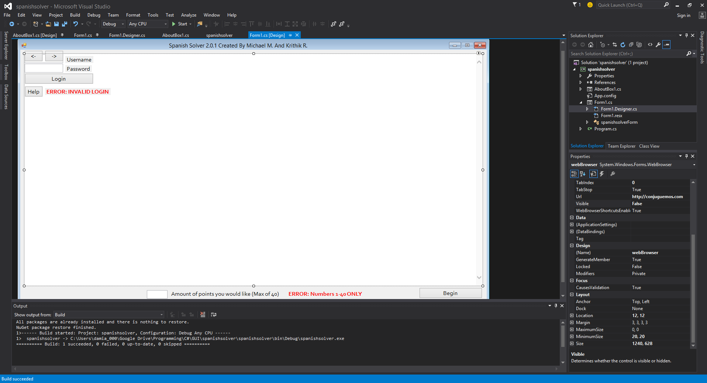

Back in 2015, me and @Neckup built a conjuguemos.com hack to quickly complete
homework.  We went through many iterations of this program to ensure that our
users could easily use it.

It started as a POC ruby script that controlled the web browser.

We eventually realized we'd need to distribute this to others via flashdrive
and ended up turning it into a C# based GUI program.

